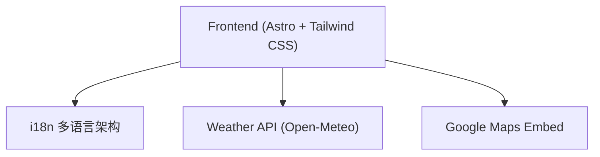

## 1. 架构设计

## 2. 技术说明
- **前端框架**: Astro (SSG 静态生成)
- **样式方案**: Tailwind CSS
- **多语言 (i18n)**: Astro 基于 JSON/字典的轻量级 i18n 方案。确保所有语言文本严格分离，无交叉混淆。默认语言为老挝语 (`lo`)。
- **外部 API**: Open-Meteo 获取实时天气及日出日落，使用固定坐标 `Latitude 17.9653, Longitude 102.6143`。
- **数据结构**: 文本数据由多语言 JSON 文件注入代码。

## 3. 路由定义
| 路由 | 用途 |
|-------|---------|
| `/` | 老挝语（默认语言）单页 |
| `/en` | 英语单页 |
| `/zh` | 中文单页 |

## 4. 关键规范要求
- **外链锚点严格绑定**: 
  - 首屏、图库、评价、页脚的 Google Maps 跳转链接：`https://maps.app.goo.gl/2zP3kvc4hLKQ7q8V6` (早市/全局)。
  - 夜市专区跳转：`https://maps.app.goo.gl/4opj9mpJvT2TJudD7`。
- **图片命名规范**: 必须使用 kebab-case（如 `talat-sao-1.jpg`），读取路径为 `public/gallery/`。
- **内容合规**: 严禁出现“琅勃拉邦”字眼，地点须明确为“老挝万象市”。
- **i18n 隔离**: 切换语言时，不允许任何未翻译的内容残留在页面上。
