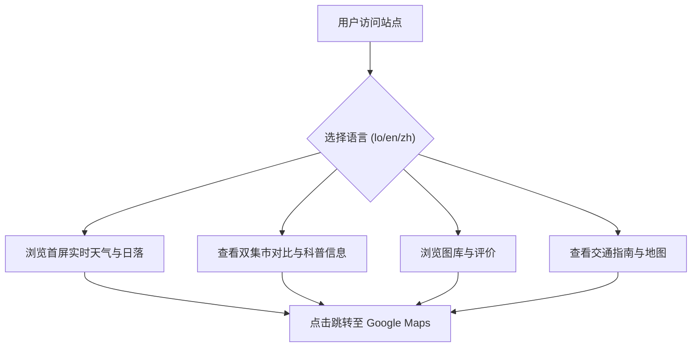

## 1. 产品概述
非营利性景点科普落地页，将万象最具代表性的【永珍早市 Talat Sao】与【永珍夜市 Vientiane Night Market】融合为一个“日夜双核”的万象集市完整指南。
- 目标：提供专业、权威、高颜值且多语言支持（老挝语、英语、中文）的非营利性百科风格旅游指南。
- 价值：通过环境动态（天气/日落/蓝调时刻）、精准地图导览、文化历史科普，倡导社区旅游与文化保护。

## 2. 核心功能

### 2.1 角色权限
本站为纯展示型非营利单页网站，无用户注册和权限区分。所有访问者均可浏览全部多语言内容。

### 2.2 功能模块
1. **多语言单页落地页 (Single Landing Page)**: 涵盖页头导航、首屏动态背景、双集市核心对比、历史文化科普、照片墙、游客评价、地图与交通、页脚声明。

### 2.3 页面详情
| 页面名称 | 模块名称 | 功能描述 |
|-----------|-------------|---------------------|
| 首页 (Home) | 页头与导航 (Header/Nav) | Logo、多语言切换器 (Lao/EN/ZH)、锚点导航 |
| 首页 (Home) | 首屏 (Hero) | 动态背景图、万象实时天气/日落倒计时 (API 坐标: 17.9653, 102.6143)、CTA按钮 |
| 首页 (Home) | 双集市对比 (Double Market Core) | 早市与夜市的评分/特色介绍、Tailwind 营业时间/交通建议对比表 |
| 首页 (Home) | 历史与文化 (History & Cultural) | Talat Sao 历史演变、纺织文化科普、老挝购物礼仪 |
| 首页 (Home) | 图库 (Photo Gallery) | `public/gallery/` 图片读取，支持放大预览与位置跳转链接 |
| 首页 (Home) | 游客评价 (Reviews) | Google Maps 评分展示与游客评价词云总结 |
| 首页 (Home) | 地图与交通 (Interactive Map) | 交通建议、右侧嵌入官方 Google Maps Iframe |
| 首页 (Home) | 页脚 (Footer) | 非营利科普声明、快速跳转链接 |

## 3. 核心流程
用户进入网站，可选择语言并浏览日夜双集市的各项信息，最终可通过外部链接前往 Google Maps。

## 4. 用户界面设计
### 4.1 设计风格
- 主色调：采用代表东南亚自然与日夜交替的自然色调（如清晨的温暖橙黄、夜市湄公河的深蓝）。
- 字体：使用干净、高级的无衬线字体以匹配百科质感。
- 布局风格：极简、克制的界面，注重全端响应式适配。使用卡片和折叠面板（Accordion）以降低高密度文本视觉负担。
- 视觉原则：严禁滥用 Emoji，严禁 AI 痕迹，保持中性客观、专业权威。

### 4.2 页面设计概览
| 页面名称 | 模块名称 | UI 元素 |
|-----------|-------------|-------------|
| 首页 | Header | 吸顶导航栏，下拉语言切换组件 |
| 首页 | Hero | 全屏背景，悬浮天气/日落数据卡片，主呼吁按钮 |
| 首页 | 对比表 | 干净的 Tailwind 响应式表格/卡片对比设计 |
| 首页 | 图库 | 瀑布流或网格布局，点击弹窗 Modal |

### 4.3 响应式要求
采用桌面端优先（Desktop-first）但全面适配移动端（Mobile-adaptive）。移动端下导航转为汉堡菜单，对比表格转为垂直卡片堆叠，地图自适应宽度。
